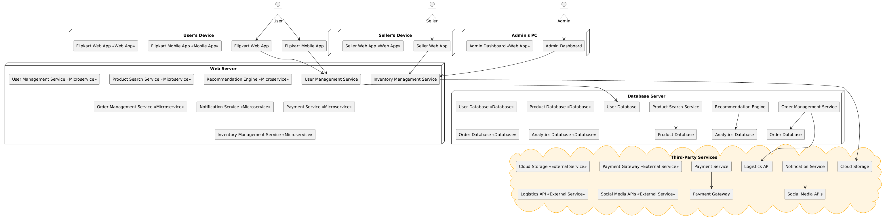

# Flipkart Clone Architecture

## 1. System Context Diagram

The System Context Diagram for a Flipkart Clone provides an overview of how users and external systems interact with the application. Key external actors include:  
- **Customers**: Browse products, place orders, and track deliveries.  
- **Sellers**: Manage inventory, list products, and process orders.  
- **Delivery Agents**: Manage and track order deliveries.  
- **Third-party APIs**: Enable integration with payment gateways, logistics providers, and marketing platforms.

---

## 2. Container Diagram

The Container Diagram outlines the primary containers within the Flipkart Clone:  
- **Web and Mobile Applications**: User-facing interfaces for browsing products, placing orders, and managing accounts.  
- **Backend Services**: Handle business logic, inventory management, order processing, and recommendations.  
- **Databases**: Store data related to products, users, orders, payments, and analytics.  

---

## 3. Component Diagrams

The Component Diagram focuses on core functionalities for customers, sellers, and delivery agents:  

### For Customers:
- **Product Browsing and Search**: Enable users to search, filter, and browse products.  
- **Cart Management**: Handles adding/removing items from the cart.  
- **Order Management**: Supports placing orders, payments, and tracking deliveries.  
- **Recommendations**: Provides personalized product recommendations based on browsing and purchase history.  

### For Sellers:
- **Product Listing Management**: Allows sellers to add, update, and remove product listings.  
- **Inventory Management**: Tracks stock levels for listed products.  
- **Order Processing**: Manages order acceptance and shipment preparation.  

### For Delivery Agents:
- **Delivery Assignment**: Assigns orders to delivery agents based on location and availability.  
- **Delivery Tracking**: Enables real-time tracking of deliveries.  

---

## 4. Deployment Diagram

The Deployment Diagram demonstrates the deployment architecture for the Flipkart Clone:  
- **User Devices**: Access the platform via web browsers or mobile apps.  
- **Load Balancers**: Distribute incoming requests across backend servers for high availability.  
- **Backend Servers**: Host APIs for business logic, user authentication, and order processing.  
- **Databases**: Separate databases to store:  
  - **Product Data**: Includes details about product listings, descriptions, and pricing.  
  - **User Data**: Stores customer profiles, seller information, and delivery agent details.  
  - **Order Data**: Tracks order statuses, payment transactions, and delivery updates.  
- **Content Delivery Network (CDN)**: Delivers static assets such as product images, CSS, and JavaScript efficiently.  
- **External Integrations**: Connect with third-party APIs for:  
  - **Payment Processing**: Secure handling of payments via multiple gateways.  
  - **Logistics Services**: For shipping and tracking orders.  
  - **Marketing Tools**: To enable email campaigns, ads, and analytics.  
