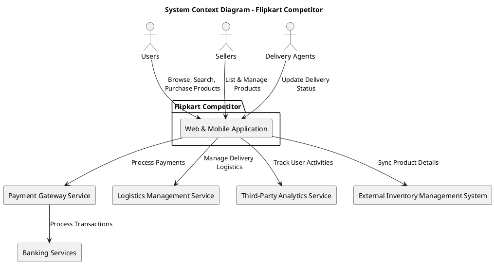
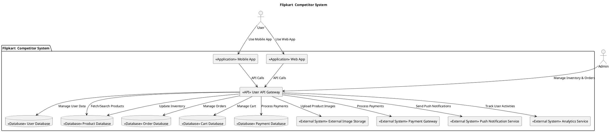
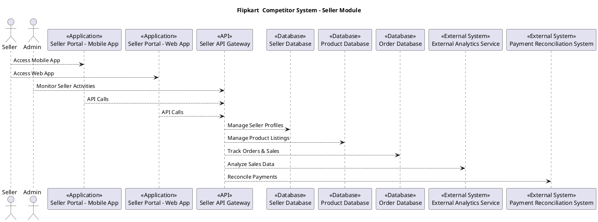
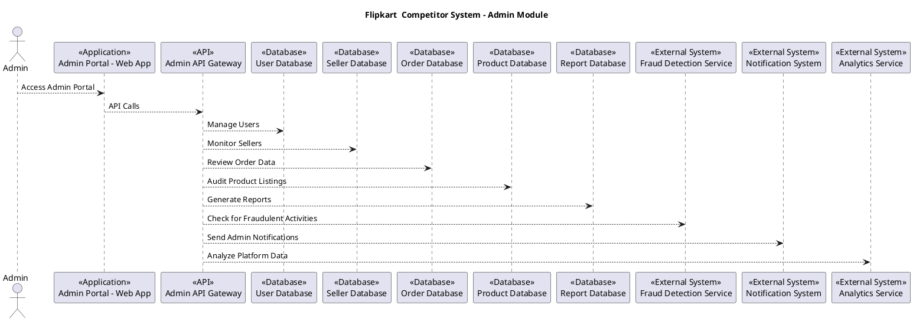

# Flipkart Competitor Architecture

## 1. System Context Diagram

The System Context Diagram provides an overview of how users and external systems interact with the application. Key external actors include:

- **Customers**: Browse products, place orders, and track deliveries.
- **Sellers**: Manage inventory, list products, and process orders.
- **Delivery Agents**: Handle and track deliveries, with the delivery process completely managed by third-party services.
- **Third-party APIs**: Integrate with payment gateways, logistics providers, and marketing platforms. These APIs manage payments, delivery assignments, and tracking, as well as external services for promotions and other features.

---

## 2. Container Diagram  

The Container Diagram outlines the primary containers within the Flipkart Competitor, divided into **User**, **Seller**, and **Admin** roles:  

### **User**

  

- **Web and Mobile Applications**: User interfaces for browsing products, placing orders, and managing accounts.  
- **Backend Services**: Handles business logic, user authentication, order tracking, and personalized recommendations.  
- **Databases**: Stores data related to user accounts, order history, preferences, and payment details.  

### **Seller**

- **Seller Dashboard (Web/Mobile)**: Interface for managing product listings, inventory, and order fulfillment.  
- **Backend Services**: Handles inventory management, order processing, seller performance analytics, and catalog updates.  
- **Databases**: Stores seller data, product information, stock levels, and sales data.  

### **Admin**

- **Admin Dashboard (Web)**: Interface for monitoring user activity, managing vendors, resolving disputes, and generating reports.  
- **Backend Services**: Handles user management, vendor approvals, platform health monitoring, and reporting.  
- **Databases**: Stores administrative data, user/vendor records, transaction logs, and complaint histories.  

---

## 3. Component Diagram

The Component Diagram focuses on core functionalities for customers, sellers, and delivery agents:  

### For Customers

- **Product Browsing and Search**: Enable users to search, filter, and browse products.  
- **Cart Management**: Handles adding/removing items from the cart.  
- **Order Management**: Supports placing orders, payments, and tracking deliveries.  
- **Recommendations**: Provides personalized product recommendations based on browsing and purchase history.  

### For Sellers

- **Product Listing Management**: Allows sellers to add, update, and remove product listings.  
- **Inventory Management**: Tracks stock levels for listed products.  
- **Order Processing**: Manages order acceptance and shipment preparation.  

### For Delivery Agents

- **Delivery Assignment**: The assignment of orders to delivery agents based on location and availability is completely handled by third-party services.
- **Delivery Tracking**: Real-time tracking of deliveries is also managed by third-party services.

---

## 4. Deployment Diagram

The Deployment Diagram outlines the architecture of the Flipkart  Competitor, highlighting the interaction between its components and third-party services.

## Key Components
### Detailed Explanation of Key Components for Flipkart Clone

#### **1. User, Seller, and Admin Devices**
- **Users**:
  - Access via web browsers and mobile apps.
  - Core features: Browse products, search, view product details, add items to the cart, place orders, and track deliveries.
  - User interface designed for seamless navigation and responsiveness.
- **Sellers**:
  - This app allows them to upload and manage products,track orders,manage inventory,view analytics,receive notifications
  - Features include uploading product details, managing inventory, and processing orders.
  - Integration with analytics tools to monitor sales performance.
- **Admins**:
  - Use an **Admin Dashboard** for operational oversight.
  - Monitor inventory, user activities, seller compliance, and key metrics.
  - Perform critical tasks like flagging suspicious activities or updating platform-wide configurations.

#### **2. Load Balancers**
- **Purpose**: Distribute incoming requests across backend servers to ensure:
  - High availability.
  - Scalability.
  - Optimal resource utilization.
- **Implementation**:
  - Tools like AWS Elastic Load Balancer or Nginx.
  - Features include health checks, SSL termination, and traffic routing.
- **Use Cases in Flipkart Clone**:
  - Direct user traffic to the least busy server.
  - Manage surges during sales events (e.g., "Big Billion Day").

#### **3. Backend Servers**
- **Microservices Architecture**:
  - Separate services for user management, product search, orders, payments, and recommendations.
  - Each service scales independently to meet demand.
- **Core Services**:
  - **User Management**: Authentication (e.g., OAuth/JWT), user registration, and profile updates.
  - **Product Search**: Efficient querying using ElasticSearch for full-text search, sorting, and filtering.
  - **Order Management**: Coordinates order placement, payment validation, and delivery tracking.
  - **Recommendations**: AI-powered algorithms analyze user behavior to suggest products.
  - **Payment Processing**: Secure transactions via integrated gateways like Razorpay or Stripe.

#### **4. Databases**
- **Primary Databases**:
  - Relational DB (e.g., PostgreSQL/MySQL): Manages structured data like user accounts and orders.
  - NoSQL DB (e.g., MongoDB/Redis): Used for caching and handling unstructured data.
- **Data Storage**:
  - **Users**: Stores profiles, order history, and saved addresses.
  - **Products**: Catalogs with categories, inventory levels, and pricing.
  - **Orders**: Tracks status (pending, shipped, delivered), payment details, and delivery estimates.
  - **Analytics**: Logs user interactions for business insights.

#### **5. Third-Party Services**
- **Payment Gateway**:
  - Ensures secure, real-time payment processing.
  - Supports multiple payment methods (credit cards, UPI, wallets).
- **Logistics API**:
  - Manages delivery via courier partners.
  - Tracks shipments and updates users on delivery status.
- **Social Media APIs**:
  - Facilitates sharing deals and product links.
  - Enables login via platforms like Google or Facebook.
- **Cloud Storage**:
  - Stores static assets (e.g., images, CSS, videos).
  - Examples: AWS S3 or Google Cloud Storage.

#### **6. Content Delivery Network (CDN)**
- **Purpose**: Accelerates content delivery and minimizes server load by caching assets closer to users.
- **Key Features**:
  - **Edge Servers**: Serve static files (CSS, JavaScript, product images) from regional servers.
  - **Origin Server**: Central repository for static and dynamic content.
  - **Cache Management**: Configures time-to-live (TTL) for frequently accessed resources.
  - **Load Balancing**: Routes user requests to the nearest edge server.
  - **Security Enhancements**: Protects against DDoS attacks and enforces secure connections.
- **Use Case in Flipkart Clone**:
  - Improves loading times for users accessing the platform from various locations.
  - Reduces latency during high-traffic periods, such as festive sales.
---

### **Summary**
The architecture is designed to ensure:
1. **Scalability**: Microservices and load balancers adapt to traffic surges.
2. **Reliability**: Redundant systems and real-time monitoring mitigate failures.
3. **Seamless User Experience**: CDNs and responsive design enhance accessibility and speed.
4. **Efficient Operations**: Well-defined roles for users, sellers, and admins streamline functionality. 
