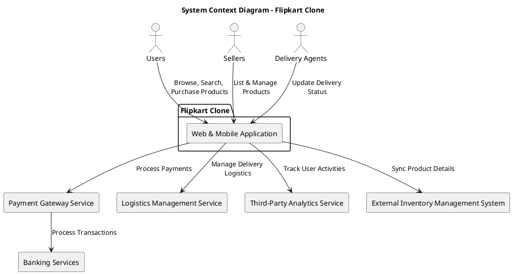
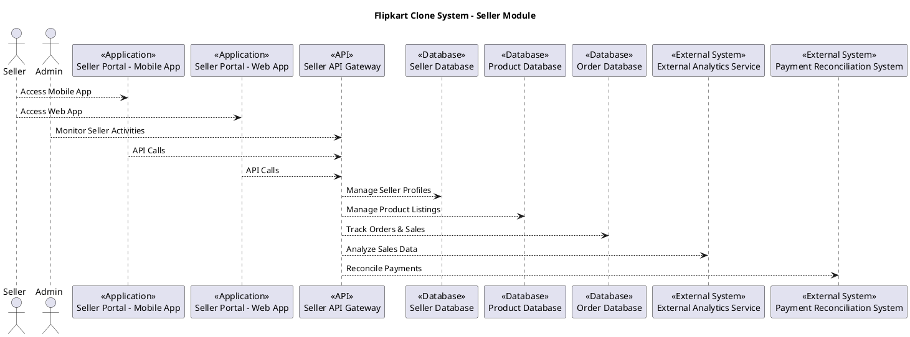
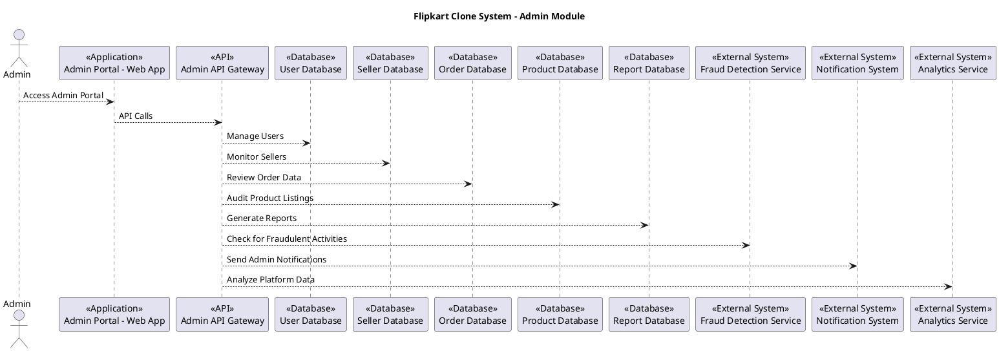

# Flipkart Clone Architecture

## 1. System Context Diagram

The System Context Diagram provides an overview of how users and external systems interact with the application. Key external actors include:

- **Customers**: Browse products, place orders, and track deliveries.
- **Sellers**: Manage inventory, list products, and process orders.
- **Delivery Agents**: Handle and track deliveries, with the delivery process completely managed by third-party services.
- **Third-party APIs**: Integrate with payment gateways, logistics providers, and marketing platforms. These APIs manage payments, delivery assignments, and tracking, as well as external services for promotions and other features.

---

## 2. Container Diagram  

The Container Diagram outlines the primary containers within the Flipkart Clone, divided into **User**, **Seller**, and **Admin** roles:  

### **User**

  

- **Web and Mobile Applications**: User interfaces for browsing products, placing orders, and managing accounts.  
- **Backend Services**: Handles business logic, user authentication, order tracking, and personalized recommendations.  
- **Databases**: Stores data related to user accounts, order history, preferences, and payment details.  

### **Seller**

- **Seller Dashboard (Web/Mobile)**: Interface for managing product listings, inventory, and order fulfillment.  
- **Backend Services**: Handles inventory management, order processing, seller performance analytics, and catalog updates.  
- **Databases**: Stores seller data, product information, stock levels, and sales data.  

### **Admin**

- **Admin Dashboard (Web)**: Interface for monitoring user activity, managing vendors, resolving disputes, and generating reports.  
- **Backend Services**: Handles user management, vendor approvals, platform health monitoring, and reporting.  
- **Databases**: Stores administrative data, user/vendor records, transaction logs, and complaint histories.  

---

## 3. Component Diagram

The Component Diagram focuses on core functionalities for customers, sellers, and delivery agents:  

### For Customers

- **Product Browsing and Search**: Enable users to search, filter, and browse products.  
- **Cart Management**: Handles adding/removing items from the cart.  
- **Order Management**: Supports placing orders, payments, and tracking deliveries.  
- **Recommendations**: Provides personalized product recommendations based on browsing and purchase history.  

### For Sellers

- **Product Listing Management**: Allows sellers to add, update, and remove product listings.  
- **Inventory Management**: Tracks stock levels for listed products.  
- **Order Processing**: Manages order acceptance and shipment preparation.  

### For Delivery Agents

- **Delivery Assignment**: The assignment of orders to delivery agents based on location and availability is completely handled by third-party services.
- **Delivery Tracking**: Real-time tracking of deliveries is also managed by third-party services.

---

## 4. Deployment Diagram

The Deployment Diagram outlines the architecture of the Flipkart Clone, highlighting the interaction between its components and third-party services.

## Key Components

### 1. **User, Seller, and Admin Devices**

- **Users**: Access via web and mobile apps to browse products, place orders, and track deliveries.  
- **Sellers**: Use the seller app to manage product listings and orders.  
- **Admins**: Oversee inventory, users, and analytics via the Admin Dashboard.

### 2. **Load Balancers**

- Distribute user requests across backend servers for high availability and scalability.

### 3. **Backend Servers**

- Microservices handle:
  - **User Management**: Authentication and profile management.
  - **Product Search**: Browse and search for items.
  - **Order Management**: Process and update orders.
  - **Recommendations**: Generate personalized product suggestions.
  - **Payments**: Handle secure transactions.

### 4. **Databases**

- Store data for:
  - **Users**: Profiles and account details.
  - **Products**: Listings and pricing.
  - **Orders**: Payment and delivery status.
  - **Analytics**: Metrics for insights.

### 5. **Third-Party Services**

- **Payment Gateway**: For secure payments.  
- **Logistics API**: To handle shipping and delivery.  
- **Social Media APIs**: For marketing and sharing deals.  
- **Cloud Storage**: For static assets like product images.

### 6. **Content Delivery Network (CDN)**

- Speeds up delivery of static assets for a seamless user experience.

## Summary

The architecture ensures scalability, reliability, and seamless operations for users, sellers, and admins, with efficient integrations for payments, logistics, and content delivery.

