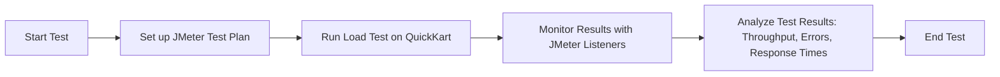

# Test Plan for  QuickKart (Flipkart Clone) Project

The test plan aims to ensure the Flipkart clone application meets functional, performance, and security requirements. It includes testing **User APIs** (registration, login, cart, orders, and reviews), **Seller APIs** (product management, orders, and reviews), and **Admin APIs** (user, seller, product, and order management). Testing types include **Functional Testing** (API endpoint validation), **Performance Testing** (load and stress tests), and **Security Testing** (authentication and authorization). The testing will be done using tools like **Postman** for APIs, **JMeter** for load testing, and **OWASP ZAP** for security. The testing phase will last for 4 weeks, with deliverables including detailed test cases, defect reports, performance metrics, and final approval for production deployment. The goal is to ensure the platform is stable, secure, and ready for production.

# Test Design Specification for QuickKart (Flipkart Clone)

## 1. Introduction
Test design for Flipkart clone, focusing on user, seller, and admin functionality.

## 2. Features to be Tested
- **User**: Registration, login, cart, orders, reviews.
- **Seller**: Product management, orders, reviews.
- **Admin**: User, seller, product, order, review management.

## 3. Testing Approach
- **Unit Testing**: Individual API function testing.
- **API Testing**: Use **Postman** for API testing.
- **Performance Testing**: Use **JMeter** for load testing.

## 4. Tools
- **Postman**: API Testing
- **JMeter**: Performance Testing

## 5. Test Data
- **Valid**: Expected inputs.
- **Invalid**: Incorrect inputs.
- **Edge Case**: Boundary value testing.

## 6. Execution Flow
1. Setup test environment.
2. Test APIs for users, sellers, admins.
3. Run system, performance, and security tests.
4. Perform regression tests after fixes.

# Test Case Document - QuickKart (Flipkart Clone)

## Feature: User Features

---

### Test Case ID: TC-REG-001
**Description**: Verify that a user can successfully register with valid information.

#### Precondition:
- User is on the registration page.

#### Steps:
1. Open the registration page.
2. Enter valid information (name, email, password).
   - Name: "John Doe"
   - Email: "john@example.com"
   - Password: "password123"
3. Submit the registration form.

#### Expected Result:
1. The user should be successfully registered.
2. The user should be redirected to the login page.
3. A success message should be displayed, e.g., "Registration successful."


#### Chai.js Code:
```javascript
const chai = require('chai');
const expect = chai.expect;
const registrationPage = require('../pages/registrationPage');

describe('User Registration', function() {
  it('should register user successfully', function() {
    registrationPage.open();
    registrationPage.fillRegistrationForm('John Doe', 'john@example.com', 'password123');
    registrationPage.submitForm();
    expect(registrationPage.getSuccessMessage()).to.equal('Registration successful');
    expect(browser.getUrl()).to.include('/login');
  });
});

```

---

### Test Case ID: TC-LOGIN-002
**Description**: Verify that a user can log in with valid credentials.

#### Precondition:
- User is on the login page.

#### Steps:
1. Open the login page.
2. Enter valid email and password (e.g., email: "john@example.com", password: "password123").
3. Submit the login form.

#### Expected Result:
1. The user should be logged in successfully.
2. The user should be redirected to the homepage.


#### Chai.js Code:
```javascript
const chai = require('chai');
const expect = chai.expect;
const loginPage = require('../pages/loginPage');

describe('User Login', function() {
  it('should log in user successfully', function() {
    loginPage.open();
    loginPage.fillLoginForm('john@example.com', 'password123');
    loginPage.submitForm();
    expect(browser.getUrl()).to.include('/home');
  });
});
```

---

### Test Case ID: TC-PRODUCTS-003
**Description**: Verify that a user can view the list of all products.

#### Precondition:
- User is logged in and on the homepage.

#### Steps:
1. Navigate to the "Products" section.

#### Expected Result:
1. A list of all products should be displayed.

#### Test Status:
- **Pending/Pass/Fail** _(Update after execution)_

#### Chai.js Code:
```javascript
const chai = require('chai');
const expect = chai.expect;
const productPage = require('../pages/productPage');

describe('View All Products', function() {
  it('should display all products', function() {
    productPage.open();
    const products = productPage.getAllProducts();
    expect(products.length).to.be.greaterThan(0);
  });
});
```

---

### Test Case ID: TC-CART-004
**Description**: Verify that a user can add products to the cart.

#### Precondition:
- User is logged in and on a product details page.

#### Steps:
1. Click the "Add to Cart" button on a product page.

#### Expected Result:
1. The product should be added to the cart.
2. The cart counter should update.
3. A confirmation message should be displayed.


#### Chai.js Code:
```javascript
const chai = require('chai');
const expect = chai.expect;
const productPage = require('../pages/productPage');
const cartPage = require('../pages/cartPage');

describe('Add Product to Cart', function() {
  it('should add product to the cart', function() {
    productPage.open('product_id_123');
    productPage.clickAddToCart();
    expect(productPage.getCartConfirmation()).to.include('Added to Cart');
    cartPage.open();
    expect(cartPage.getCartItems()).to.include('product_id_123');
  });
});
```

---

### Test Case ID: TC-ORDER-005
**Description**: Verify that a user can place an order.

#### Precondition:
- User has added products to the cart.

#### Steps:
1. Go to the cart and click "Place Order."
2. Enter shipping details and select payment method.
3. Confirm the order.

#### Expected Result:
1. The order should be placed successfully.
2. The user should see an order confirmation message.


#### Chai.js Code:
```javascript
const chai = require('chai');
const expect = chai.expect;
const checkoutPage = require('../pages/checkoutPage');

describe('Place Order', function() {
  it('should place the order successfully', function() {
    checkoutPage.open();
    checkoutPage.fillShippingDetails('John Doe', '123 Main St', 'City', '123456');
    checkoutPage.selectPaymentMethod('Credit Card');
    checkoutPage.confirmOrder();
    const confirmationMessage = checkoutPage.getOrderConfirmationMessage();
    expect(confirmationMessage).to.equal('Your order has been placed successfully!');
  });
});
```

---

## Feature: Seller Features

---

### Test Case ID: TC-SELLER-REGISTER-006
**Description**: Verify that a seller can register with valid details.

#### Precondition:
- Seller is on the registration page.

#### Steps:
1. Enter seller name, email, password, and business details.
2. Submit the registration form.

#### Expected Result:
1. The seller should be registered successfully.
2. The seller should be redirected to the seller dashboard.


#### Chai.js Code:
```javascript
const chai = require('chai');
const expect = chai.expect;
const sellerRegistrationPage = require('../pages/sellerRegistrationPage');

describe('Seller Registration', function() {
  it('should register seller successfully', function() {
    sellerRegistrationPage.open();
    sellerRegistrationPage.fillSellerRegistrationForm('Seller A', 'seller@example.com', 'password123');
    sellerRegistrationPage.submitForm();
    expect(browser.getUrl()).to.include('/seller-dashboard');
  });
});
```

---

### Test Case ID: TC-SELLER-ADD-PRODUCT-007
**Description**: Verify that a seller can add a new product.

#### Precondition:
- Seller is logged in and on the product listing page.

#### Steps:
1. Enter product name, price, description, and upload images.
2. Submit the product listing.

#### Expected Result:
1. The product should be added to the catalog.
2. A success message should be displayed.


#### Chai.js Code:
```javascript
const chai = require('chai');
const expect = chai.expect;
const productListingPage = require('../pages/productListingPage');

describe('Seller Add Product', function() {
  it('should add a new product to the catalog', function() {
    productListingPage.open();
    productListingPage.enterProductDetails('Smartphone', '49999', 'High quality smartphone', 'smartphone.jpg');
    productListingPage.submitProduct();
    expect(productListingPage.getSuccessMessage()).to.include('Product listed successfully');
  });
});
```

---

### Test Case ID: TC-SELLER-MANAGE-ORDER-008
**Description**: Verify that a seller can manage order status.

#### Precondition:
- Seller is logged in and has received an order.

#### Steps:
1. Go to the "Orders" section.
2. Update the order status to "Shipped."

#### Expected Result:
1. The order status should be updated to "Shipped."


#### Chai.js Code:
```javascript
const chai = require('chai');
const expect = chai.expect;
const orderManagementPage = require('../pages/orderManagementPage');

describe('Seller Manage Order', function() {
  it('should update order status to Shipped', function() {
    orderManagementPage.open();
    orderManagementPage.updateOrderStatus('order_id_123', 'Shipped');
    const status = orderManagementPage.getOrderStatus('order_id_123');
    expect(status).to.equal('Shipped');
  });
});
```

---

## Feature: Admin Features

---

### Test Case ID: TC-ADMIN-MANAGE-USERS-009
**Description**: Verify that the admin can retrieve all users.

#### Precondition:
- Admin is logged in and on the "Users" page.

#### Steps:
1. Navigate to the "Users" section.

#### Expected Result:
1. The list of all users should be displayed.


#### Chai.js Code:
```javascript
const chai = require('chai');
const expect = chai.expect;
const usersPage = require('../pages/usersPage');

describe('Admin Manage Users', function() {
  it('should retrieve all users', function() {
    usersPage.open();
    const users = usersPage.getUsersList();
    expect

(users.length).to.be.greaterThan(0);
  });
});
```

---

## Feature: Third-Party APIs

---

### Test Case ID: TC-DELIVERY-010
**Description**: Verify that the third-party delivery API returns correct delivery details.

#### Precondition:
- Order has been placed by the user.

#### Steps:
1. Trigger the third-party delivery API with the order details.
2. Retrieve the delivery status from the API response.

#### Expected Result:
1. The delivery API should return accurate delivery details (e.g., delivery date, carrier).


#### Chai.js Code:
```javascript
const chai = require('chai');
const expect = chai.expect;
const axios = require('axios');

describe('Delivery API', function() {
  it('should return correct delivery details for the order', async function() {
    const orderId = 'order_id_123';
    const response = await axios.get(`https://delivery-api.com/status?order_id=${orderId}`);
    expect(response.status).to.equal(200);
    expect(response.data).to.have.property('delivery_date');
    expect(response.data).to.have.property('carrier');
  });
});
```

---

### Test Case ID: TC-PAYMENT-011
**Description**: Verify that the third-party payment API processes payment successfully.

#### Precondition:
- User has placed an order and selected a payment method.

#### Steps:
1. Trigger the payment API with the order and payment details.
2. Verify that the payment is processed successfully.

#### Expected Result:
1. The payment API should process the payment and return a success message.


#### Chai.js Code:
```javascript
const chai = require('chai');
const expect = chai.expect;
const axios = require('axios');

describe('Payment API', function() {
  it('should process the payment successfully', async function() {
    const paymentDetails = { orderId: 'order_id_123', amount: 49999, method: 'Credit Card' };
    const response = await axios.post('https://payment-api.com/charge', paymentDetails);
    expect(response.status).to.equal(200);
    expect(response.data).to.have.property('payment_status').and.equal('success');
  });
});
```

---

### Test Case ID: TC-MAPS-012
**Description**: Verify that the third-party maps API returns correct location for the user’s address.

#### Precondition:
- User has entered a shipping address during checkout.

#### Steps:
1. Trigger the maps API with the shipping address.
2. Retrieve the geolocation and map coordinates from the API response.

#### Expected Result:
1. The maps API should return correct geolocation data with latitude and longitude.


#### Chai.js Code:
```javascript
const chai = require('chai');
const expect = chai.expect;
const axios = require('axios');

describe('Maps API', function() {
  it('should return correct location for the user address', async function() {
    const address = '123 Main St, City, Country';
    const response = await axios.get(`https://maps-api.com/geocode?address=${encodeURIComponent(address)}`);
    expect(response.status).to.equal(200);
    expect(response.data).to.have.property('location');
    expect(response.data.location).to.have.property('latitude');
    expect(response.data.location).to.have.property('longitude');
  });
});
```

---

## ALL  Test Cases

| **Test Case ID**  | **Description**                                           | **Feature**             | **Purpose**                                                                                           |
|-------------------|-----------------------------------------------------------|-------------------------|-------------------------------------------------------------------------------------------------------|
| TC-REG-001        | User registration with valid details                      | User Features           | Verifies that users can successfully register with valid information.                               |
| TC-LOGIN-002      | User login with valid credentials                         | User Features           | Ensures that users can log in successfully with the correct credentials.                             |
| TC-PRODUCTS-003   | View list of products                                    | User Features           | Confirms that the user can view all available products.                                               |
| TC-CART-004       | Add product to the cart                                  | User Features           | Verifies that products can be successfully added to the cart.                                        |
| TC-ORDER-005      | Place an order                                           | User Features           | Ensures that the user can place an order after adding products to the cart.                           |
| TC-SELLER-REGISTER-006 | Seller registration with valid details                | Seller Features         | Verifies that sellers can register successfully with valid details.                                  |
| TC-SELLER-ADD-PRODUCT-007 | Add a product to catalog                           | Seller Features         | Confirms that the seller can add a new product to the catalog.                                       |
| TC-SELLER-MANAGE-ORDER-008 | Manage order status                                | Seller Features         | Verifies that the seller can update order statuses.                                                  |
| TC-ADMIN-MANAGE-USERS-009 | Admin manages user accounts                         | Admin Features          | Ensures that the admin can retrieve and manage users.                                                |
| TC-DELIVERY-010   | Delivery API returns correct delivery details            | Third-party API         | Confirms that the delivery API provides correct shipping details.                                     |
| TC-PAYMENT-011    | Payment API processes payment successfully               | Third-party API         | Verifies that the payment API processes payments correctly.                                          |
| TC-MAPS-012       | Maps API returns correct location for the user address   | Third-party API         | Ensures that the maps API returns accurate geolocation information.                                   |

---

# Performance Testing for QuickKart Clone with JMeter

## 1. Tools
- **JMeter**: For load testing, stress testing, and measuring performance.

## 2. Types of Tests
- **Load Testing**: Measure system performance under the expected user load (e.g., 1000 users).
- **Stress Testing**: Evaluate system behavior under extreme load (e.g., 5000 users).
- **Spike Testing**: Test system's response to sudden traffic spikes.
- **Endurance Testing**: Assess system performance over extended periods (e.g., 24 hours).

## 3. JMeter Test Plan Setup

### 3.1. Creating Test Plan
1. **Thread Group**: Set users (e.g., 1000 users) and ramp-up time (e.g., 60 seconds).
2. **HTTP Request Sampler**: Define API requests to simulate:
   - User actions (e.g., registration, login).
   - Product browsing (search, filter).
   - Order placement.
   - Cart management.
3. **Timers**: Use timers to simulate realistic user behavior (e.g., 2-second delay between actions).
4. **Listeners**: 
   - **View Results Tree**: Monitor response data.
   - **Summary Report**: View overall statistics like throughput and error rate.
   - **Graph Results**: Analyze response time graphs.

### 3.2. Test Scenario Example
- **Objective**: Test registration of 1000 users simultaneously on QuickKart.
- **Steps**:
  1. Set 1000 users in Thread Group.
  2. Simulate user registration via the registration API.
  3. Set response time assertion (e.g., ≤ 2 seconds per request).
  4. Run the test for 10 minutes and monitor results.

### 3.3. Analyzing Results
- **Throughput**: Measure the number of requests per minute.
- **Response Time**: Average time for each request (e.g., login, product search).
- **Error Rate**: Percentage of failed requests.
- **System Resources**: Monitor CPU and memory usage during the test.

## 4. Execution Flow


This document provides comprehensive test cases covering the essential functionality of QuickKart (Flipkart Clone). All major features, including user, seller, admin functionalities, and third-party API integrations, are tested to ensure a seamless user experience. In addition, performance testing is conducted using JMeter to assess the system's behavior under various load conditions. This includes load testing, stress testing, spike testing, and endurance testing to ensure that QuickKart can handle both expected and extreme traffic while maintaining optimal performance.

