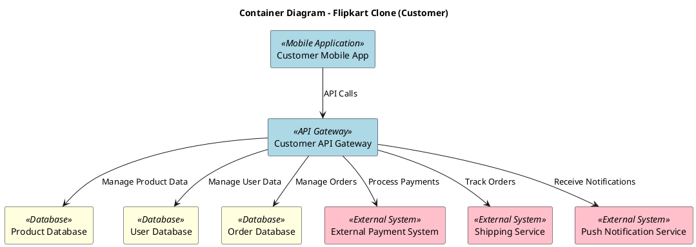
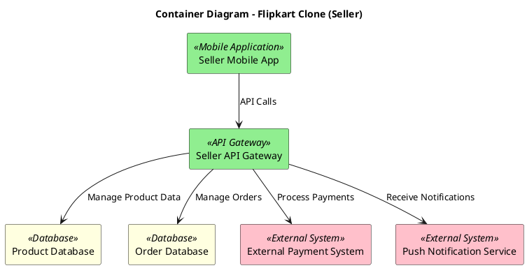
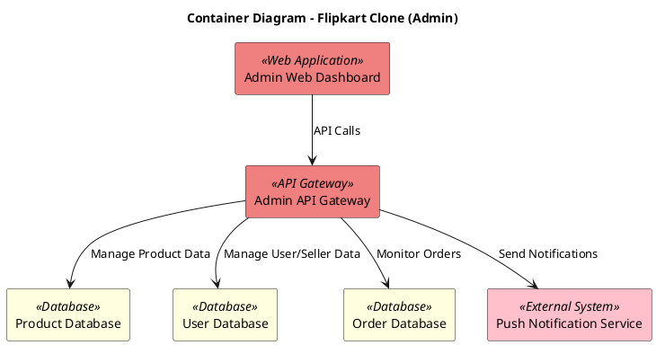
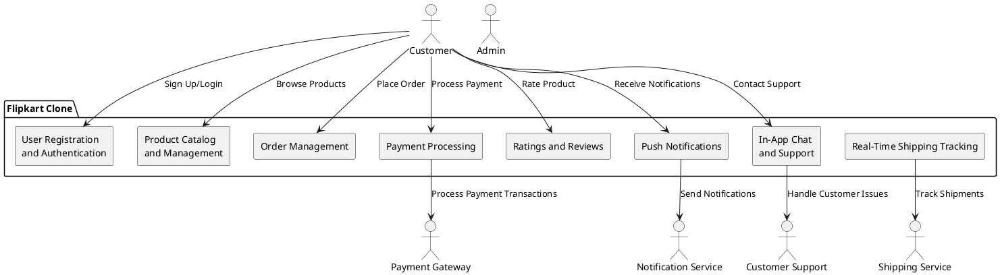

# System Context Diagram

```plantuml
@startuml

' External Actors
actor "Customer (User)" as Customer
actor "Seller (Vendor)" as Seller
actor "Admin" as Admin
actor "Payment Gateway" as PaymentGateway
actor "Shipping Service" as ShippingService
actor "Notification Service" as NotificationService
actor "Customer Support" as CustomerSupport

' System Boundary: Flipkart Clone
package "Flipkart Clone" {

    ' Subsystems
    rectangle "User Registration \nand Authentication" as Registration
    rectangle "Product Catalog \nand Management" as ProductCatalog
    rectangle "Order Management" as OrderManagement
    rectangle "Payment Integration" as Payment
    rectangle "Ratings and Reviews" as Ratings
    rectangle "Admin Panel" as AdminPanel
    rectangle "Push Notifications" as PushNotifications
    rectangle "In-App Chat \nand Support" as ChatSupport
    rectangle "Real-Time Shipping Tracking" as ShippingTracking
    rectangle "Customer Support" as Support
}

' Relationships between actors and system components
Customer --> Registration : Sign Up/Login
Customer --> ProductCatalog : Browse Products
Customer --> OrderManagement : Place Order
Customer --> Payment : Process Payment
Customer --> Ratings : Rate Product
Customer --> PushNotifications : Receive Notifications
Customer --> ChatSupport : Contact Support

Seller --> Registration : Register/Login
Seller --> ProductCatalog : Manage Products
Seller --> OrderManagement : Manage Orders
Seller --> PushNotifications : Receive Notifications

Admin --> AdminPanel : Manage Users/Sellers/Orders
Admin --> ProductCatalog : Manage Products
Admin --> OrderManagement : Monitor Orders
Admin --> Payment : Monitor Payments
Admin --> PushNotifications : Send Notifications
Admin --> Ratings : Manage Reviews

' External Interactions
Payment --> PaymentGateway : Process Payment Transactions
ShippingTracking --> ShippingService : Track Shipments
PushNotifications --> NotificationService : Send Notifications
Support --> CustomerSupport : Handle Customer Issues

@enduml
```



# Container Diagram

## Customer Code



## Seller Code



## Admin Code



# Component Diagram

## Customer Code



# Deployment Diagram

```plantuml
@startuml
title Deployment Diagram - Flipkart Clone System

node "Customer's Mobile Device" {
    [Customer Mobile App] <<Mobile App>>
}

node "Seller's Mobile Device" {
    [Seller Mobile App] <<Mobile App>>
}

node "Admin's PC" {
    [Admin Web Dashboard] <<Web App>>
}

node "Web Server" {
    [Order Management Service] <<Microservice>>
    [Payment Service] <<Microservice>>
    [User Management Service] <<Microservice>>
    [Product Catalog Service] <<Microservice>>
}

node "Database Server" {
    database "Product Database" as ProductDB
    database "User Database" as UserDB
    database "Order Database" as OrderDB
}

cloud "Third-Party Services" {
    [Payment Gateway] <<External Service>>
    [Shipping Service] <<External Service>>
}

' Connections
[Customer Mobile App] --> [Order Management Service] : "Place Order"
[Customer Mobile App] --> [Payment Service] : "Process Payment"
[Customer Mobile App] --> [Product Catalog Service] : "Browse Products"
[Customer Mobile App] --> [User Management Service] : "Manage Profile"

[Seller Mobile App] --> [Product Catalog Service] : "Manage Products"
[Seller Mobile App] --> [Order Management Service] : "Manage Orders"
[Seller Mobile App] --> [Payment Service] : "View Earnings"

[Admin Web Dashboard] --> [Product Catalog Service] : "Manage Products"
[Admin Web Dashboard] --> [Order Management Service] : "Monitor Orders"
[Admin Web Dashboard] --> [User Management Service] : "Manage Users"

[Order Management Service] --> ProductDB : "Manage Product Data"
[Payment Service] --> ProductDB : "Access Product Info"
[Payment Service] --> OrderDB : "Manage Order Data"
[User Management Service] --> UserDB : "Manage User Data"

[Payment Service] --> [Payment Gateway] : "Process Payment"
[Order Management Service] --> [Shipping Service] : "Track Orders"

@enduml
